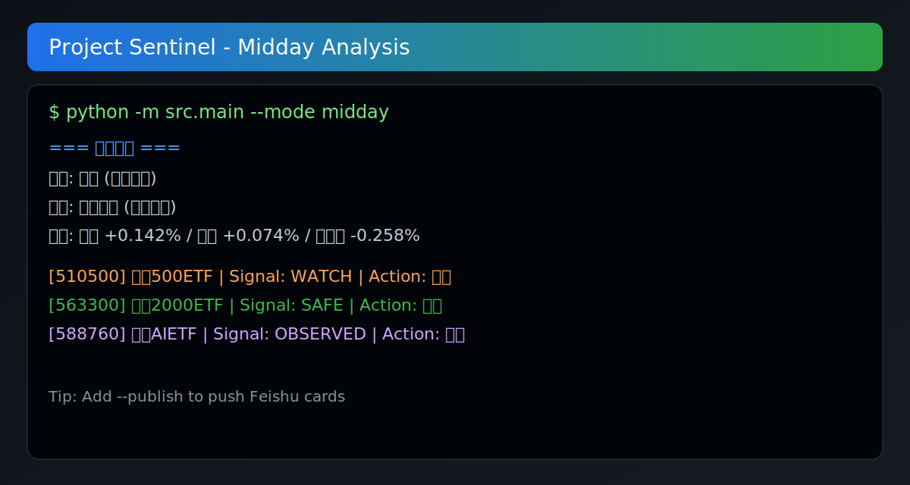
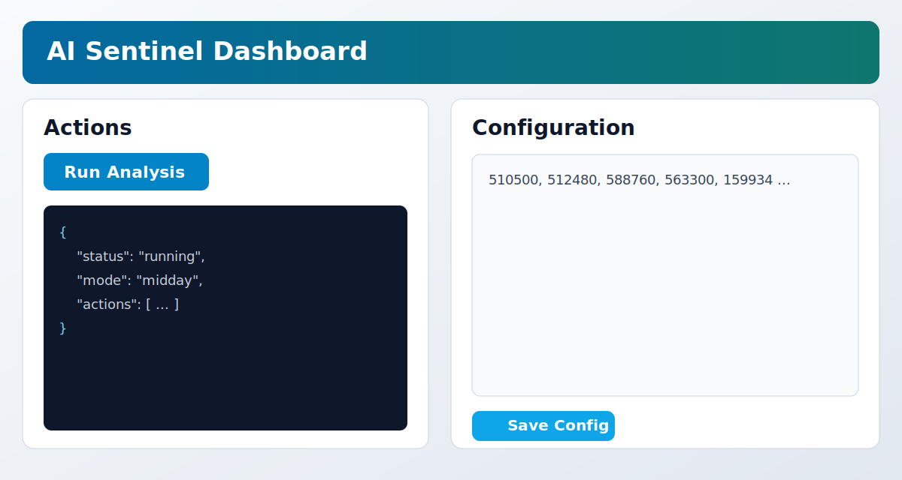

# Project Sentinel / A股 AI 投研哨兵

<p align="center">
  <a href="https://github.com/sunny-kobe/ai_sentiney/stargazers"></a>
  <a href="https://github.com/sunny-kobe/ai_sentiney/network/members"></a>
  <a href="https://github.com/sunny-kobe/ai_sentiney/issues"></a>
  <a href="./LICENSE"></a>
</p>

> 一个面向 A 股投资者和开发者的开源 AI 分析系统：
> 自动采集行情与新闻，生成午盘/收盘/盘前策略，支持飞书推送、问答追问、趋势分析和 WebUI。

## Navigation / 导航

- 中文：`Why This Project` / `30 秒看效果` / `Quick Start` / `Q&A` / `Roadmap`
- English: `Why This Project` / `30s Demo` / `Quick Start` / `Q&A` / `Roadmap`

## Showcase

CLI Preview:



WebUI Preview:



## Why This Project

你不需要再在行情软件、新闻流、群消息之间来回切换。

`Project Sentinel` 的核心目标是把这件事自动化：
- 采集层：多数据源容灾（Tencent -> Efinance -> AkShare）
- 计算层：技术指标 + 规则信号 + 命中追踪
- 分析层：Gemini 生成结构化结论
- 触达层：终端 / JSON / 飞书 / WebUI

一句话：**不是自动交易，而是自动生成“可执行的下一步动作”。**

## 30 秒看效果

```bash
python -m src.main --mode midday
```

示例输出（节选）：

```text
=== 午盘分析 ===
情绪: 分歧 (缩量整固)
量能: 缩量阴跌 (买盘匮乏)
指数: 上证指数 +0.142% / 深证成指 +0.074% / 创业板指 -0.258%
  [510500] 中证500ETF | 信号:WATCH | 操作:观望
  [563300] 中证2000ETF | 信号:SAFE  | 操作:锁仓
```

## Features

- 三时段自动分析：`morning` / `midday` / `close`
- 多源容灾采集：单一数据源异常时自动切换
- 指标引擎：MA、MACD、RSI、BOLL、KDJ、ATR、OBV 等
- 信号追踪：对昨日信号做命中回溯与统计
- 智能追问：基于缓存上下文做二次问答（`--ask`）
- 趋势分析：自动识别“最近一周/本月走势”等问题
- 推送与展示：飞书卡片 + 本地 WebUI
- 可扩展：清晰的 source / processor / analyst 分层

## Quick Start

### 1. 克隆项目

```bash
git clone https://github.com/sunny-kobe/ai_sentiney.git
cd ai_sentiney
```

### 2. 安装依赖

```bash
python3 -m venv .venv
source .venv/bin/activate  # Windows: .venv\Scripts\activate
pip install -r requirements.txt
```

### 3. 配置密钥

```bash
cp .env.example .env
```

编辑 `.env`：

```ini
GEMINI_API_KEY=your_gemini_api_key_here
FEISHU_WEBHOOK=https://open.feishu.cn/open-apis/bot/v2/hook/your_webhook_id
```

### 4. 配置持仓

编辑 `config.yaml` 中的 `portfolio` 列表。

### 5. 运行

```bash
# 午盘分析（默认最常用）
python -m src.main --mode midday

# 收盘复盘
python -m src.main --mode close

# 盘前简报
python -m src.main --mode morning

# 推送到飞书
python -m src.main --mode midday --publish

# JSON 输出（便于二次开发）
python -m src.main --mode midday --output json
```

## Q&A / 趋势追问

```bash
# 基于最近一次缓存追问
python -m src.main --ask "黄金ETF今天怎么样"

# 指定日期 + 模式追问
python -m src.main --ask "半导体板块情况如何" --date 2026-02-07 --mode close

# 趋势问题（自动走多日上下文）
python -m src.main --ask "最近一周市场走势如何"
```

## WebUI

```bash
python -m src.main --webui
```

打开 `http://localhost:8000`

支持：
- 健康检查
- 手动触发分析
- 基础配置编辑

## CLI 参数

| 参数 | 说明 |
|---|---|
| `--mode {midday,close,morning}` | 分析模式 |
| `--publish` | 推送飞书（默认不推） |
| `--dry-run` | 试运行，不调昂贵 API |
| `--replay` | 使用历史缓存重放分析 |
| `--output {text,json}` | 输出格式 |
| `--ask "问题"` | 进入追问模式 |
| `--date YYYY-MM-DD` | 指定日期上下文 |
| `--webui` | 启动 WebUI |

## Architecture

```text
src/
  collector/   # 数据采集与多源容灾
  processor/   # 指标计算、信号生成、命中追踪
  analyst/     # Gemini 分析与结构化输出
  reporter/    # 飞书推送
  service/     # 主流程编排
  web/         # 轻量 WebUI
```

## Why Star This Repo

- 不是 demo：有完整数据链路、容灾、回放、推送、问答
- 可直接改造：适合作为你的 AI 投研底座
- 结构清晰：易于接入新数据源、新策略、新推送渠道
- 对开源友好：MIT 协议，欢迎 Fork 二次开发

如果这个项目对你有帮助，欢迎点一个 Star。

## Good First Issues

适合首次贡献者：
- [迁移 `google-generativeai` 到 `google.genai`（保持接口兼容）](https://github.com/sunny-kobe/ai_sentiney/issues)
- [为 WebUI 增加只读模式和简单鉴权](https://github.com/sunny-kobe/ai_sentiney/issues)
- [补充 `--replay` 与 `--ask` 的集成测试](https://github.com/sunny-kobe/ai_sentiney/issues)
- [新增 Dockerfile 与 `docker-compose` 快速部署](https://github.com/sunny-kobe/ai_sentiney/issues)

如果你愿意认领其中一个方向，欢迎先提一个 Issue 或 Draft PR。

## Automation

仓库内置 GitHub Actions 定时任务（交易日时段）用于自动运行与数据落库，详见：
- `.github/workflows/daily_sentinel.yml`

## Roadmap

- [ ] 迁移到新版 `google.genai` SDK（替代 `google-generativeai`）
- [ ] 增加回测与信号评估报告导出
- [ ] 增加更多推送渠道（企业微信 / Telegram）
- [ ] 提供 Docker 一键部署
- [ ] 提供更完整的 API 文档与前端展示

## Contributing

欢迎 Issue / PR。建议先读：
- `CONTRIBUTING.md`

你可以从这些方向开始：
- 接入新数据源
- 新增或改进技术指标
- 优化提示词与分析结果结构
- 增强 UI / API / 自动化部署

## Disclaimer

本项目仅用于学习与研究，不构成任何投资建议。
市场有风险，决策需独立判断，自行承担风险。

## License

[MIT](./LICENSE)
