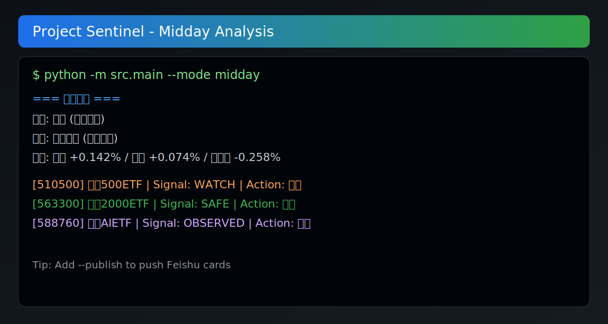
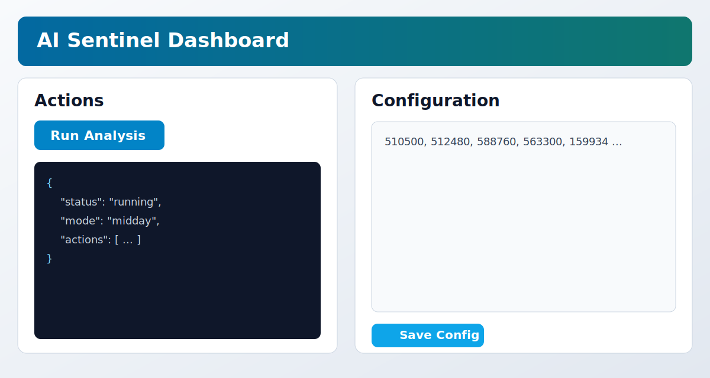

# Project Sentinel / A股 AI 投研哨兵

<p align="center">
  <a href="https://github.com/sunny-kobe/ai_sentiney/stargazers"></a>
  <a href="https://github.com/sunny-kobe/ai_sentiney/network/members"></a>
  <a href="https://github.com/sunny-kobe/ai_sentiney/issues"></a>
  <a href="./LICENSE"></a>
</p>

> 一个面向 A 股投资者和开发者的开源 AI 分析系统：
> 自动采集行情与新闻，生成中期持仓策略、午盘/收盘/盘前诊断，支持飞书推送、问答追问、趋势分析和 WebUI。

## Navigation / 导航

- 中文：`Why This Project` / `30 秒看效果` / `Quick Start` / `Q&A` / `Roadmap`
- English: `Why This Project` / `30s Demo` / `Quick Start` / `Q&A` / `Roadmap`

## Showcase

CLI Preview:



WebUI Preview:



## Why This Project

你不需要再在行情软件、新闻流、群消息之间来回切换。

`Project Sentinel` 的核心目标是把这件事自动化：
- 采集层：多数据源容灾（Tencent -> Efinance -> AkShare）
- 计算层：技术指标 + 规则信号 + 中期跟踪评估
- 分析层：`swing` 规则引擎负责中期结论，Gemini 保留给午盘/收盘/盘前叙述
- 触达层：终端 / JSON / 飞书 / Telegram / WebUI

一句话：**不是自动交易，而是自动生成“可执行的下一步动作”。**

当前主模式已经切到 `swing`：
- 目标周期：`2-8` 周
- 输出格式：`今日结论 / 账户动作 / 持仓处理 / 观察池机会 / 风险清单`
- 评估口径：`10/20/40` 个交易日的 `平均收益 / 平均超额 / 平均回撤`
- 不再把短线命中率作为主KPI，`midday` / `close` 只保留为战术诊断
- 新增 `验证摘要`：把真实建议跟踪、正式回测、滚动验证压缩成一段你能直接读懂的结论
- 新增 `compact validation snapshot`：CLI JSON / WebUI / 推送统一显示真实样本、历史样本和进攻权限

## 30 秒看效果

```bash
python -m src.main --mode swing
```

示例输出（节选）：

```text
=== 中期策略 ===
市场结论:
  当前偏防守，先守住已有成果，弱势方向以收缩仓位为主。
组合动作:
  持有: 沪深300ETF
  减配: 中证2000ETF
持仓清单:
  [510300] 沪深300ETF | 结论:持有
    原因: 还站在20日线 4.01 上方，主趋势还在，承接还在配合。
    计划: 先把现有仓位拿住，等下一次确认转强再决定要不要加。
    风险线: 收盘跌回20日线 4.01 下方，就先缩仓。
```

## Features

- 四种模式：`swing` / `morning` / `midday` / `close`
- 中期主模式：`swing` 直接给出 `增配 / 持有 / 减配 / 回避 / 观察`
- `swing` 推送会额外附带一条 `实验提示`，自动比较激进中线 preset，告诉你当前哪组实验更值得参考
- 持仓优先：围绕真实 `portfolio` 和少量 `watchlist` 生成中长期动作
- 多源容灾采集：单一数据源异常时自动切换
- 指标引擎：MA、MACD、RSI、BOLL、KDJ、ATR、OBV 等
- 对称信号体系：卖出侧（DANGER/WARNING/WATCH）+ 买入侧（OPPORTUNITY/ACCUMULATE）
- 中期评估：按 `10/20/40` 个交易日统计 `平均收益 / 平均超额 / 平均回撤`
- 正式验证：新增组合级回测与滚动验证摘要，用来约束中期进攻信号
- 历史实验：支持按时间区间 / 最近 N 天 / 真实持仓范围发起中期验证
- 日内诊断：`midday` / `close` 保留短线信号追踪，但不再作为主策略 KPI
- 智能追问：基于缓存上下文做二次问答（`--ask`）
- 趋势分析：自动识别”最近一周/本月走势”等问题
- 推送与展示：飞书卡片 + Telegram + 本地 WebUI
- 可扩展：清晰的 source / processor / analyst 分层

## Quick Start

### 1. 克隆项目

```bash
git clone https://github.com/sunny-kobe/ai_sentiney.git
cd ai_sentiney
```

### 2. 安装依赖

```bash
python3 -m venv .venv
source .venv/bin/activate  # Windows: .venv\Scripts\activate
pip install -r requirements.txt
```

### 3. 配置密钥

```bash
cp .env.example .env
```

编辑 `.env`：

```ini
GEMINI_API_KEY=your_gemini_api_key_here
FEISHU_WEBHOOK=https://open.feishu.cn/open-apis/bot/v2/hook/your_webhook_id
TELEGRAM_BOT_TOKEN=your_telegram_bot_token_here
TELEGRAM_CHAT_ID=your_telegram_chat_id_here
```

### 4. 配置持仓

编辑 `config.yaml` 中的 `portfolio` 列表。

如果希望 `swing` 报告按你的真实账户给出“当前仓位 / 目标仓位 / 调仓份额”，需要同时维护真实持仓和少量观察池：

```yaml
portfolio_state:
  cash_balance: 33091.73
  lot_size: 100

portfolio:
  - code: "510300"
    name: "沪深300ETF"
    cost: 4.033
    shares: 600
    strategy: "value"

watchlist:
  - code: "512660"
    name: "军工ETF"
    strategy: "trend"
    priority: "high"
```

- `cash_balance`: 当前账户现金
- `shares`: 当前持仓份额/股数
- `lot_size`: 默认按 A 股/ETF 的 `100` 份整数手估算调仓动作
- `watchlist`: 少量观察池，不参与当前持仓收益统计，但允许进入“试仓区”推荐
- `priority`: 观察池优先级，决定机会排序时的参考权重

`swing` 现在会优先给出：
- 持仓该继续拿、加、减还是退出
- 观察池里最多 `0-3` 个值得试仓的中期机会
- 一段 `验证摘要`，说明这类动作最近的历史质量

### 5. 运行

```bash
# 中期主模式（默认推荐）
python -m src.main --mode swing

# 中期主模式并推送到飞书
python -m src.main --mode swing --publish

# 直接查看中期验证快照
python -m src.main --mode swing --validation-report

# 直接查看压缩 JSON 验证快照
python -m src.main --mode swing --validation-report --output json

# 对最近 60 个交易日做正式历史验证
python -m src.main validate --mode swing --days 60

# 直接看最近哪类动作/资产在拖后腿
python -m src.main validate --mode swing --days 60 --group-by action
python -m src.main validate --mode swing --days 90 --group-by cluster --output json

# 验证指定时间区间
python -m src.main validate --mode swing --from 2026-03-01 --to 2026-03-25

# 只验证指定标的
python -m src.main validate --mode swing --from 2026-03-01 --to 2026-03-25 --codes 510300 512660

# 用真实持仓 + 观察池做中期实验
python -m src.main experiment --preset aggressive_midterm --mode swing

# 给实验结果追加分组诊断
python -m src.main experiment --preset aggressive_midterm --mode swing --group-by action

# 策略实验台：对比 baseline vs candidate
python -m src.main lab --preset aggressive_midterm
python -m src.main lab --preset aggressive_trend_guard --output json
python -m src.main lab --preset aggressive_leader_focus --output json
python -m src.main lab --preset aggressive_core_rotation --output json --detail full
python -m src.main lab --preset defensive_exit_fix --override confidence_min=高 --output json

# 查看中期验证摘要
python -m src.main --ask "最近验证情况怎么样" --mode swing

# 午盘分析（默认最常用）
python -m src.main --mode midday

# 收盘复盘
python -m src.main --mode close

# 盘前简报
python -m src.main --mode morning

# 推送到飞书（默认）
python -m src.main --mode midday --publish

# 推送到 Telegram
python -m src.main --mode midday --publish --publish-target telegram

# JSON 输出（便于二次开发）
python -m src.main --mode swing --output json
```

## Q&A / 趋势追问

```bash
# 中期问题（自动走 10/20/40 交易日统计）
python -m src.main --ask "最近一个月中期方向如何" --mode swing

# 基于最近一次缓存追问
python -m src.main --ask "黄金ETF今天怎么样"

# 指定日期 + 模式追问
python -m src.main --ask "半导体板块情况如何" --date 2026-02-07 --mode close

# 趋势问题（自动走多日上下文）
python -m src.main --ask "最近一周市场走势如何"
```

## WebUI

```bash
python -m src.main --webui
```

打开 `http://localhost:8000`

支持：
- 健康检查
- 手动触发分析
- 基础配置编辑
- `swing` 验证面板：直接看真实样本 / 历史样本 / 回测笔数 / 进攻权限
- 页面加载后自动拉取 `/api/validation?mode=swing`

## CLI 参数

| 参数 | 说明 |
|---|---|
| `--mode {swing,midday,close,morning}` | 分析模式 |
| `--publish` | 推送到发布渠道（默认不推） |
| `--publish-target {feishu,telegram}` | 推送目标（默认 feishu） |
| `--dry-run` | 试运行，不推送；`swing` 下会直接拉实时行情做预览 |
| `--replay` | 使用历史缓存重放分析，适合验证渲染/结构，不替代实时预览 |
| `--validation-report` | 直接输出当前模式的验证摘要；`swing` 下文本显示自然语言总结，JSON 默认返回 compact snapshot |
| `--output {text,json}` | 输出格式 |
| `--ask "问题"` | 进入追问模式 |
| `--date YYYY-MM-DD` | 指定日期上下文 |
| `--webui` | 启动 WebUI |

## Architecture

```text
src/
  collector/   # 数据采集与多源容灾
  processor/   # 指标计算、信号生成、命中追踪
  analyst/     # Gemini 分析与结构化输出
  reporter/    # 推送渠道（飞书 / Telegram）
  service/     # 主流程编排
  backtest/    # 中长期正式回测与滚动验证
  web/         # 轻量 WebUI
```

## Why Star This Repo

- 不是 demo：有完整数据链路、容灾、回放、推送、问答
- 可直接改造：适合作为你的 AI 投研底座
- 结构清晰：易于接入新数据源、新策略、新推送渠道
- 对开源友好：MIT 协议，欢迎 Fork 二次开发

如果这个项目对你有帮助，欢迎点一个 Star。

## Good First Issues

适合首次贡献者：
- [为 WebUI 增加只读模式和简单鉴权](https://github.com/sunny-kobe/ai_sentiney/issues)
- [补充 `--replay` 与 `--ask` 的集成测试](https://github.com/sunny-kobe/ai_sentiney/issues)
- [新增 Dockerfile 与 `docker-compose` 快速部署](https://github.com/sunny-kobe/ai_sentiney/issues)

如果你愿意认领其中一个方向，欢迎先提一个 Issue 或 Draft PR。

## Automation

仓库内置 GitHub Actions 定时任务（交易日时段）用于自动运行与数据落库，详见：
- `.github/workflows/daily_sentinel.yml`

当前支持：
- 定时推送：`morning` / `midday` / `close` / `swing`
- 手动触发：可在 Actions 页面选择 `mode` 与 `publish_target`

## Roadmap

- [x] 迁移到新版 `google.genai` SDK（替代 `google-generativeai`）
- [ ] 增加回测与信号评估报告导出
- [x] 增加 Telegram 推送渠道
- [x] 买入侧信号体系（OPPORTUNITY / ACCUMULATE）
- [x] 增加 `swing` 中期策略模式与 `10/20/40` 评估
- [ ] 提供 Docker 一键部署
- [ ] 提供更完整的 API 文档与前端展示

## Contributing

欢迎 Issue / PR。建议先读：
- `CONTRIBUTING.md`

你可以从这些方向开始：
- 接入新数据源
- 新增或改进技术指标
- 优化提示词与分析结果结构
- 增强 UI / API / 自动化部署

## Disclaimer

本项目仅用于学习与研究，不构成任何投资建议。
市场有风险，决策需独立判断，自行承担风险。

## License

[MIT](./LICENSE)
