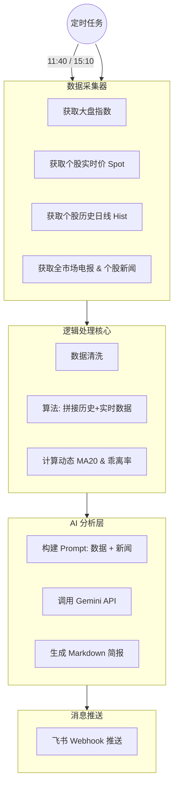

---

# 📘 Project Sentinel: A股智能投顾系统 · 技术规格说明书
**Project Code**: `SENTINEL_V2`
**Version**: 2.0 (Gemini Enhanced Edition)
**Owner**: [Your Name]
**Status**: Ready for Dev

---

## 1. 🚀 核心概念 (Executive Summary)

### 1.1 产品定义

**Project Sentinel** 是一个运行在本地的“全栈式 AI 投顾助理”。它不直接进行自动交易，而是充当你的 **情报官 (Intelligence Officer)** 和 **风控官 (Risk Officer)**。

### 1.2 解决的核心痛点

1.  **数据碎片化**: 免去手动查看行情软件、财联社电报、个股公告的繁琐。
2.  **决策情绪化**: 依靠代码逻辑（MA20 生命线）强制进行冷酷的买卖判断。
3.  **信息不对称**: 利用 Gemini 的长文本能力，结合个股新闻，识别“杀估值”或“错杀”的时刻。

### 1.3 运作模式 (The Newsroom Model)

系统模拟了一个微型报社：

- **记者 (Python/AkShare)**: 跑腿采集数据和新闻。
- **主编 (Google Gemini)**: 阅读所有素材，撰写分析报告。
- **邮差 (Feishu/Lark)**: 将排版好的 Markdown 简报推送到你的手机。

---

## 2. 🏗 系统架构 (System Architecture)

### 2.1 技术栈 (Tech Stack)

- **语言**: Python 3.9+
- **数据源 (Data Layer)**: `AkShare` (A 股行情 + 财联社电报 + 东方财富个股新闻)
- **计算层 (Logic Layer)**: `Pandas` (清洗与指标计算), `Real-time Splicing Algo` (实时均线拼接)
- **大脑层 (AI Layer)**: `Google Gemini Pro` (via `google-generativeai` SDK)
- **触达层 (Presentation)**: `Feishu Webhook` (飞书机器人)

### 2.2 数据流图 (Data Flow)



---

## 3. 📦 功能模块详述 (Module Specifications)

### 3.1 🕷️ 模块一：全维数据采集 (The Collector)

该模块负责将互联网的非结构化数据转化为结构化 JSON。

- **功能点 1: 实时行情 (Stability Enhanced)**
  - API: `ak.stock_zh_a_spot_em()` (个股实时) 或 `ak.stock_zh_a_hist_min_em()` (分钟线，更稳)。
  - **稳定性要求**: 必须增加 `Retry(max=3, delay=1s)` 机制，防止网络抖动导致任务失败。
  - _目的_: 获取当前这一秒的价格（或 5 分钟线收盘价），用于午间判断。
- **功能点 2: 舆情与资金侦测**
  - **资金**: `ak.stock_hsgt_north_net_flow_in_em()` -> 获取北向资金实时净流入，作为“聪明钱”风向标。
  - **宏观**: `ak.stock_telegraph_cls()` -> 获取财联社电报。
  - **个股**: `ak.stock_news_em(symbol)` -> 获取你持仓股票最近的 3 条新闻标题。
- **功能点 3: 市场全景 (Market Breadth)** (New)
  - API: `ak.stock_zh_a_spot_em()` 统计全市场 `涨跌家数比` (如: 涨 4000/跌 500)。
  - _目的_: 量化市场真实温度，辅助大盘定调。

### 3.2 🧮 模块二：动态指标计算 (The Processor)

**核心算法：实时均线拼接 (Real-time MA Stitching)**

由于盘中没有当天的收盘价，导致无法直接计算当日 MA20。解决方案如下：

```python
# 伪代码逻辑 (v2.0 Optimized)
History_List = Get_Last_19_Days_Close()
Current_Price = Get_Realtime_Price()

# 1. 均线计算
Combined_Data = History_List + [Current_Price]
Realtime_MA20 = Average(Combined_Data)

# 2. 资金因子
North_Money = Get_Northbound_Net_Flow() # 单位: 亿

# 3. 综合判断 (Anti-Whipsaw & Smart Money)
threshold = 0.995 # 0.5% 缓冲，防止假摔
if Current_Price < (Realtime_MA20 * threshold):
    if North_Money > 30:
        Status = "WATCH (主力洗盘?)" # 跌破但北向大买
    else:
        Status = "DANGER (Effective Breakdown)"
else:
    Status = "SAFE"
```

### 3.3 🧠 模块三：Gemini 智能分析 (The Analyst)

利用 Google Gemini 免费且强大的长文本处理能力。

- **输入 Context**:
  - `Market_Data`: 指数涨跌、大盘成交量、**北向资金**、**涨跌家数比**。
  - `News_Context`: 财联社宏观电报 + 个股利好/利空新闻。
  - `Portfolio_Data`: 持仓股的现价、动态 MA20 以及技术形态。
- **AI 任务**:
  1.  **去噪**: 忽略无关新闻，只关注影响股价的实质性利好/利空。
  2.  **归因**: 股价下跌是因为技术面回调，还是因为刚才那个“高管减持”的新闻？
  3.  **建议**: 输出 `午间操作策略` 或 `收盘复盘总结`。

---

## 4. 📝 接口定义与配置 (Configuration)

### 4.1 `config.py` (配置清单)

将敏感信息和持仓列表分离。

```python
# config.py

# 1. 密钥管理 (使用 .env,不要硬编码)
# GEMINI_API_KEY = os.getenv("GEMINI_API_KEY")
# LARK_WEBHOOK = os.getenv("LARK_WEBHOOK")

# 2. 持仓策略池 (建议迁移至 portfolio.json 以便热更新)
# Loader 函数需支持读取外部 JSON，以下为 Default 值
MY_PORTFOLIO = [
    {"code": "600519", "name": "贵州茅台", "cost": 1700, "strategy": "value"},
    {"code": "300750", "name": "宁德时代", "cost": 180, "strategy": "trend"},
    # ... 更多持仓
]

# 3. 阈值设定
RISK_PARAMS = {
    "stop_loss_pct": -0.05,  # 硬止损线
    "ma_window": 20          # 生命线周期
}
```

---

## 5. 🗣️ Prompt Engineering (提示词设计)

我们需要两套 Prompt，分别应对不同的时间窗口。

### 5.1 午间哨兵 Prompt (11:40 AM)

> **Role**: 你的身份是高频交易员，专注于日内趋势判断。
> **Context**: (传入实时数据 + 上午新闻)
> **Goal**: 决定下午 13:00 开盘后的动作。
> **Instruction**:
>
> 1. 检查所有 **Trend (波段)** 策略的股票。
> 2. **风控规则**:
>    - 如果 `Price < MA20 * 0.995` (有效跌破) 且 `北向资金 < 0` (资金流出) -> **输出 "🚨 紧急预警"**，建议离场。
>    - 如果 `Price < MA20` 但 `北向资金 > 30亿` -> **输出 "⚠️ 观察(疑似洗盘)"**。
> 3. 如果 `Price > MA20` -> **输出 "🟢 持股待涨"**。
> 4. **必须简短**，优先展示结论。

### 5.2 收盘复盘 Prompt (15:10 PM)

> **Role**: 你的身份是资深基金经理，专注于复盘与明日计划。
> **Context**: (传入收盘数据 + 全天新闻)
> **Instruction**:
>
> 1. **大盘定调**: 基于指数和宏观新闻，判断当前市场温度（冰点/过热/正常）。
> 2. **个股深度分析**: 结合新闻，解释为什么今天某只股票涨/跌？是主力洗盘还是出货？
> 3. **明日剧本**: 给出每只持仓股明天的关键点位（压力位/支撑位）。

---

## 6. 📅 实施路线图 (Implementation Plan)

### Step 1: 数据源打通 (Day 1)

- [ ] 编写 `data_fetcher.py`。
- [ ] 测试 `ak.stock_zh_a_spot_em` 获取实时数据是否顺畅。
- [ ] 测试 `ak.stock_news_em` 能否抓到新闻。

### Step 2: 逻辑与算法 (Day 1)

- [ ] 编写 `processor.py`。
- [ ] 实现 `calc_dynamic_ma20()` 函数，确保午间算出的均线和同花顺/通达信能对得上（误差 < 0.5% 即可）。

### Step 3: 接入 Gemini (Day 2)

- [ ] 编写 `ai_analyst.py`。
- [ ] 调试 Gemini API，确保它能正确理解你喂给它的 JSON 数据和新闻文本。

### Step 4: 自动化部署 (Day 2)

- [ ] 编写 `main.py` 串联所有模块。
- [ ] 设置定时任务：
  - Windows: `Task Scheduler` (任务计划程序) -> 每天 11:40 & 15:10。
  - Mac/Linux: `Crontab` -> `40 11 * * 1-5 python3 main.py --mode=midday`。

---

## 7. ⚠️ 风险控制 (Risk Management)

| 风险点       | 表现                          | 解决方案                                                                                              |
| :----------- | :---------------------------- | :---------------------------------------------------------------------------------------------------- |
| **幻觉风险** | Gemini 把旧新闻当成新新闻分析 | 在 Prompt 中强制要求 Gemini **“仅引用我提供的【今日新闻】列表，严禁编造”**。                          |
| **数据过期** | 接口返回了昨日缓存数据        | 增加 `Data Integrity Check`，校验数据时间戳是否为今天，否则报警。                                     |
| **接口超时** | 午间高峰期 AkShare 请求卡死   | 为所有网络请求添加 `timeout=10` 和 `retry=3` 机制。                                                   |
| **T+1 误判** | 刚买的股票 AI 叫你卖          | 在 `MY_PORTFOLIO` 中添加 `{"buy_date": "2023-10-01"}` 字段，代码里过滤掉 `buy_date == today` 的股票。 |
| **API 限额** | Gemini 免费版每分钟请求限制   | 我们的股票少（<10 只），一次 Request 就够了，不会触发限流。                                           |

---

**Next Step**:
你可以开始创建 `config.py` 和安装依赖库了：
`pip install akshare pandas google-generativeai requests schedule`
